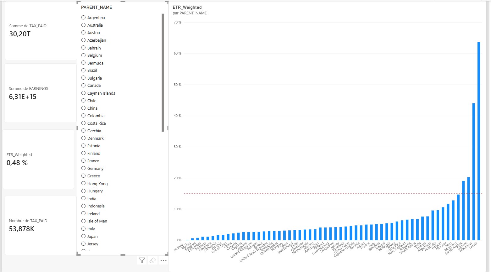

# CbCR Fiscal Analysis Dashboard & ETR Tracking

Ce projet propose une solution d'analyse fiscale basée sur les données Country-by-Country Reporting (CbCR), incluant un pipeline de nettoyage en Python et un tableau de bord Power BI interactif.

## 📌 Fonctionnalités
- **Calcul de l'ETR Effectif (`ETR_Weighted`)** : Mesure DAX gérant les cas d'exclusion (bénéfices négatifs/nuls).
- **Seuil Pillar Two (15 %)** : Ligne de référence dynamique pour identifier les juridictions sous-imposées.
- **Pipeline Python** : Nettoyage automatique et conversion des formats monétaires/locales US.

## 📊 Aperçu du Dashboard

## 🛠️ Technologies
- **Python 3.x** (Pandas)
- **Power BI Desktop** (DAX, Power Query)
